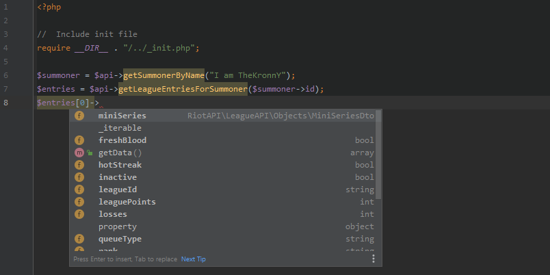
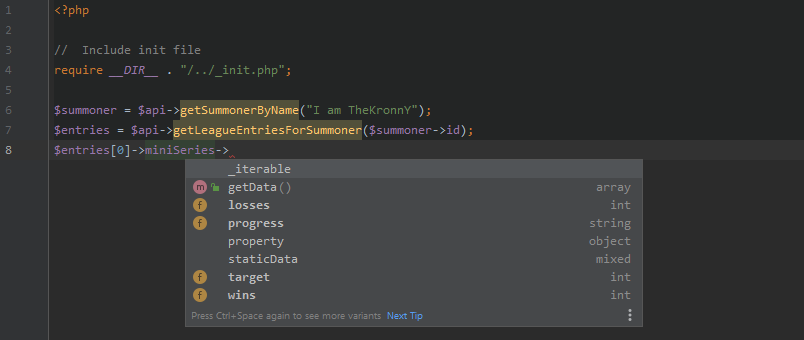

# RiotAPI PHP7 wrapper

> Version v4.0.1

[](https://travis-ci.org/dolejska-daniel/riot-api)
[](https://codeclimate.com/github/dolejska-daniel/riot-api/coverage)
[](https://packagist.org/packages/dolejska-daniel/riot-api)
[](https://packagist.org/packages/dolejska-daniel/riot-api)
[](https://www.paypal.me/dolejskad)


# Table of Contents
1. [Available versions](#available-versions)
1. [Introduction](#introduction)
2. [Downloading](#downloading)
3. [League of Legends API](#league-of-legends-api)
	1. [Resource versions](#resource-versions)
	2. [Initializing the library](#initializing-the-library)
	3. [Usage example](#usage-example)
	4. [Cache providers](#cache-providers)
	5. [Rate limiting](#rate-limiting)
	6. [Call caching](#call-caching)
	7. [Asynchronous requests](#asynchronous-requests)
	8. [StaticData endpoints](#staticdata-endpoints)
	9. [StaticData linking](#staticdata-linking)
	10. [Extensions](#extensions)
	11. [Callback functions](#callback-functions)
	12. [CLI support](#cli-support)
4. [DataDragon API](#datadragon-api)


# [Available versions](https://github.com/dolejska-daniel/riot-api/wiki/Available-versions)

| Versions | API Updates | Library features | Branch |
|----------|-------------|------------------|--------|
| [](https://packagist.org/packages/dolejska-daniel/riot-api)  | ✔ | ✔ | [master](https://github.com/dolejska-daniel/riot-api) |
| [](https://packagist.org/packages/dolejska-daniel/riot-api)  | ❌ | ❌ | [v3-dev](https://github.com/dolejska-daniel/riot-api/tree/v3-dev) |


# [Introduction](https://github.com/dolejska-daniel/riot-api/wiki/Home#introduction)
Welcome to the RiotAPI PHP7 library repo!
The goal of this library is to create easy-to-use library for anyone who might need one.
This is fully object oriented API wrapper for League of Legends' API.
A small DataDragon API wrapper is also included.

Here are some handy features:

- **[Rate limit caching](https://github.com/dolejska-daniel/riot-api/wiki/LeagueAPI:-Rate-limiting)** and limit exceeding prevention - fully automatic.
- **[Call caching](https://github.com/dolejska-daniel/riot-api/wiki/LeagueAPI:-Call-caching)** - enables the library to re-use already fetched data within given timespan - saves time and key's rate limit.
- **[StaticData endpoints](https://github.com/dolejska-daniel/riot-api/wiki/LeagueAPI:-StaticData-endpoints)** - you can work with StaticData endpoints as if they were never deprecated.
- **[StaticData linking](https://github.com/dolejska-daniel/riot-api/wiki/LeagueAPI:-StaticData-linking)** - library can automatically link related StaticData right into the returned object.
- **[Custom callbacks](https://github.com/dolejska-daniel/riot-api/wiki/LeagueAPI:-Callback-functions)** - you can set custom function which will be called before or after the request is processed.
- **[Object extensions](https://github.com/dolejska-daniel/riot-api/wiki/LeagueAPI:-Extensions)** - you can implement your own methods to the fetched API objects and enable yourself to use them later to ease of your work.
- **[CLI supported](https://github.com/dolejska-daniel/riot-api/wiki/LeagueAPI:-CLI-support)** - usage of this library in console is extremely easy.
- **Interim mode** support - you are going to be able to use the library the same way whether your key is in `interim mode` or not (meaning you won't need to change anything when you jump to production).
- **Objects everywhere** - API calls return data in special objects, this allows modern IDEs to hint existing properties and methods.





Please, refer mainly to the [wiki pages](https://github.com/dolejska-daniel/riot-api/wiki).
This file contains only general introduction to library features.


# [Downloading](https://github.com/dolejska-daniel/riot-api/wiki/Home#downloading)
The easiest way to download and use this library is via [Composer](https://getcomposer.org/).
If you are not using Composer yet, you should start **right now**!

While having Composer installed on your machine it takes only `composer require "dolejska-daniel/riot-api:^4"` command to get the library ready to roll!

For additional information about downloading and initial setup, please see [the wiki pages](https://github.com/dolejska-daniel/riot-api/wiki/Home#downloading).


# [League of Legends API](https://github.com/dolejska-daniel/riot-api/wiki/LeagueAPI:-How-to-begin)


## [Resource versions](https://github.com/dolejska-daniel/riot-api/wiki/LeagueAPI:-Resources-and-endpoints)
Below you can find table of implemented API resources and the version in which these are currently implemented.
Please refer to [wiki pages](https://github.com/dolejska-daniel/riot-api/wiki/LeagueAPI:-Resources-and-endpoints) for additional information about endpoints and resources.

| Resource         | Status |
| ---------------- | ------ |
| Account |  |
| [Champion](https://github.com/dolejska-daniel/riot-api/wiki/LeagueAPI:-Resources-and-endpoints#champion-) |  |
| [Champion Mastery](https://github.com/dolejska-daniel/riot-api/wiki/LeagueAPI:-Resources-and-endpoints#champion-mastery-) |  |
| Clash |  |
| [League](https://github.com/dolejska-daniel/riot-api/wiki/LeagueAPI:-Resources-and-endpoints#league-) |  |
| [League Exp](https://github.com/dolejska-daniel/riot-api/wiki/LeagueAPI:-Resources-and-endpoints#league-exp-) |  |
| LOR Match |  |
| LOR Ranked |  |
| Masteries |  |
| [Match](https://github.com/dolejska-daniel/riot-api/wiki/LeagueAPI:-Resources-and-endpoints#match-) |  |
| Runes |  |
| [Spectator](https://github.com/dolejska-daniel/riot-api/wiki/LeagueAPI:-Resources-and-endpoints#spectator-) |  |
| [Static Data](https://github.com/dolejska-daniel/riot-api/wiki/LeagueAPI:-Resources-and-endpoints#static-data-) |  |
| Stats |  |
| [Status](https://github.com/dolejska-daniel/riot-api/wiki/LeagueAPI:-Resources-and-endpoints#status-) |  |
| [Summoner](https://github.com/dolejska-daniel/riot-api/wiki/LeagueAPI:-Resources-and-endpoints#summoner-) |  |
| [TFT League](#) | -yellow.svg) |
| [TFT Match](#) | -yellow.svg) |
| [TFT Summoner](#) | -yellow.svg) |
| [Third Party Code](https://github.com/dolejska-daniel/riot-api/wiki/LeagueAPI%3A-Resources-and-endpoints#third-party-code-) |  |
| [Tournament](https://github.com/dolejska-daniel/riot-api/wiki/LeagueAPI:-Resources-and-endpoints#tournament---tournament-stub-) |  |
| [Tournament Stub](https://github.com/dolejska-daniel/riot-api/wiki/LeagueAPI:-Resources-and-endpoints#tournament---tournament-stub-) |  |
| VAL Content |  |
| VAL Match |  |


## [Initializing the library](https://github.com/dolejska-daniel/riot-api/wiki/LeagueAPI:-How-to-begin)
How to begin?

```php
//  Include all required files (installation via Composer is required)
require_once __DIR__  . "/vendor/autoload.php";

use RiotAPI\LeagueAPI\LeagueAPI;
use RiotAPI\LeagueAPI\Definitions\Region;

//  Initialize the library
$api = new LeagueAPI([
	//  Your API key, you can get one at https://developer.riotgames.com/
	LeagueAPI::SET_KEY    => 'YOUR_RIOT_API_KEY',
	//  Target region (you can change it during lifetime of the library instance)
	LeagueAPI::SET_REGION => Region::EUROPE_EAST,
]);

//  And now you are ready to rock!
$ch = $api->getStaticChampion(61); // Orianna <3
```

And there is a lot more settings that you can set when initializing the library - mainly to enable special features or to amend default behaviour of the library.
Please see [the wiki pages](https://github.com/dolejska-daniel/riot-api/wiki/LeagueAPI:-How-to-begin) for complete list of library's settings.


## [Usage example](https://github.com/dolejska-daniel/riot-api/wiki/LeagueAPI:-How-to-begin#usage-example)
Working with LeagueAPI can not be easier, just take a look at how to fetch summoner information based on summoner's name:

```php
//  ...initialization...

//  this fetches the summoner data and returns SummonerDto object
$summoner = $api->getSummonerByName('I am TheKronnY');

echo $summoner->id;             //  KnNZNuEVZ5rZry3I...
echo $summoner->puuid;          //  rNmb6Rq8CQUqOHzM...
echo $summoner->name;           //  I am TheKronnY
echo $summoner->summonerLevel;  //  69

print_r($summoner->getData());  //  Or array of all the data
/* Array
 * (
 *     [id] => KnNZNuEVZ5rZry3IyWwYSVuikRe0y3qTWSkr1wxcmV5CLJ8
 *     [accountId] => tGSPHbasiCOgRM_MuovMKfXw7oh6pfXmGiPDnXcxJDohrQ
 *     [puuid] => rNmb6Rq8CQUqOHzMsFihMCUy4Pd201vDaRW9djAoJ9se7myXrDprvng9neCanq7yGNmz7B3Wri4Elw
 *     [name] => I am TheKronnY
 *     [profileIconId] => 3180
 *     [revisionDate] => 1543438015000
 *     [summonerLevel] => 69
 * )
 */
```

..or how to fetch a static champion data:

```php
//  ...initialization...

//  this fetches the champion data and returns StaticChampionDto object
$champion = $api->getStaticChampion(61);

echo $champion->name;  //  Orianna
echo $champion->title; //  the Lady of Clockwork

print_r($champion->getData());  //  Or array of all the data
/* Array
 * (
 *    [id] => 61
 *    [name] => "Orianna"
 *    [key] => "Orianna"
 *    [title] => "the Lady of Clockwork"
 * )
 */
```

More usage examples for LeagueAPI can be found [here](https://github.com/dolejska-daniel/riot-api/blob/master/examples/LeagueAPI/README.md).


## [Cache providers](https://github.com/dolejska-daniel/riot-api/wiki/LeagueAPI:-Cache-providers)
Cache providers are responsible for keeping data of [rate limiting](#rate-limiting), [call caching](#call-caching) and [static data](##datadragon-api) within instances of the library for easy re-use.
This feature is automatically enabled, when any of previously mentioned features is used.

When using this feature, you can set `LeagueAPI::SET_CACHE_PROVIDER` to any class, thought it has to be compatible with PSR-6 standard, eg. implement [`Psr\Cache\CacheItemPoolInterface`](https://github.com/php-fig/cache/blob/master/src/CacheItemPoolInterface.php) interface.
By using `LeagueAPI::SET_CACHE_PROVIDER_PARAMS` or `LeagueAPI::SET_DD_CACHE_PROVIDER_PARAMS` option, you can pass any data to the cache provider class.

For additional information about cache providers, please see [the wiki pages](https://github.com/dolejska-daniel/riot-api/wiki/LeagueAPI:-Cache-providers).


## [Rate limiting](https://github.com/dolejska-daniel/riot-api/wiki/LeagueAPI:-Rate-limiting)
This clever feature will easily prevent exceeding your per key call limits & method limits.
In order to enable this feature, you have to set `LeagueAPI::SET_CACHE_RATELIMIT` to `true`.
Everything else is completly automatic, so all you need to do is to enable this feature.

For additional information about rate limiting, please see [the wiki pages](https://github.com/dolejska-daniel/riot-api/wiki/LeagueAPI:-Rate-limiting).


## [Call caching](https://github.com/dolejska-daniel/riot-api/wiki/LeagueAPI:-Call-caching)
This feature can prevent unnecessary calls to API within short timespan by temporarily saving fetched data from API and using them as the result data.
In order to enable this feature, you have to set `LeagueAPI::SET_CACHE_CALLS` to `true`.
You should also provide `LeagueAPI::SET_CACHE_CALLS_LENGTH` option to specify cached data lifetime or else default time interval of `60 seconds` will be used.

For additional information about API call caching, please see [the wiki pages](https://github.com/dolejska-daniel/riot-api/wiki/LeagueAPI:-Call-caching).


## [Asynchronous requests](https://github.com/dolejska-daniel/riot-api/wiki/LeagueAPI:-Asynchronous-requests)
This feature allows request grouping and their asynchronous sending using [Guzzle](https://github.com/guzzle/guzzle).
After request is sent and its response received, user provided callbacks are invoked with received data.

For additional information about asynchronous requests, please see [the wiki pages](https://github.com/dolejska-daniel/riot-api/wiki/LeagueAPI:-Asynchronous-requests).


## [StaticData endpoints](https://github.com/dolejska-daniel/riot-api/wiki/LeagueAPI:-StaticData-endpoints)
These endpoints provide you with easy way to transform StaticData into object instances and easily work with them.
They are also supported in numerous DataDragonAPI functions (displaying images).

For additional information about StaticData endpoints, please see [the wiki pages](https://github.com/dolejska-daniel/riot-api/wiki/LeagueAPI:-StaticData-endpoints).


## [StaticData linking](https://github.com/dolejska-daniel/riot-api/wiki/LeagueAPI:-StaticData-linking)
This feature allows you to automatically link static data related to your request, any data are managed through `DataDragonAPI`.
All the static data will be locally cached, which makes this operation very fast after its initial requests.
Also, any requests made by `DataDragonAPI` do not count towards your rate limit.

For additional information about StaticData linking, please see [the wiki pages](https://github.com/dolejska-daniel/riot-api/wiki/LeagueAPI:-StaticData-linking).


## [Extensions](https://github.com/dolejska-daniel/riot-api/wiki/LeagueAPI:-Extensions)
Using extensions for `ApiObject`s is extremely useful tool, allowing implementation of your own methods and logic into the `ApiObject`s themselves.
Extensions are enabled by using settings option `LeagueAPI::SET_EXTENSIONS` when initializing the library.

For additional information about API object extensions, please see [the wiki pages](https://github.com/dolejska-daniel/riot-api/wiki/LeagueAPI:-Extensions).


## [Callback functions](https://github.com/dolejska-daniel/riot-api/wiki/LeagueAPI:-Callback-functions)
Allows you to provide custom functions to be called before and after the actual API request is sent.

Before callbacks have ability to cancel upcomming request - when `false` is returned by _any callback_ function, exception `Exceptions\RequestException` is raised and request is cancelled.

For additional information about callback functions, please see [the wiki pages](https://github.com/dolejska-daniel/riot-api/wiki/LeagueAPI:-Callback-functions).


## [CLI support](https://github.com/dolejska-daniel/riot-api/wiki/LeagueAPI:-CLI-support)
You can also use the library in command line environment:

```shell
root@localhost:~/riot-api/src/LeagueAPICLI# leagueapicli summoner:get-by-name "I am TheKronnY" --pretty --config ~/config.json
{
    "id": "Y0ac04pquunxrtvEtxWsG8hX0EBYSFfVuuL6JsR5AaWOoLo",
    "accountId": "UIctwb-75CS_vCHe494r-cDO9zlvGzu4JVdWIb_ox7xqmg",
    "puuid": "XYPInPFGOn1mqOmkzZEtf9jzNCUTK5KviHWxNfNnmWZ_4EovMV-q02qY5rXtRGWl1Nb_oK-2D1m4Bg",
    "name": "I am TheKronnY",
    "profileIconId": 540,
    "revisionDate": 1566761498000,
    "summonerLevel": 111
}
```

For additional information about CLI support, please see [the wiki pages](https://github.com/dolejska-daniel/riot-api/wiki/LeagueAPI:-CLI-support).
More usage examples for LeagueAPICLI can be found [here](https://github.com/dolejska-daniel/riot-api/blob/master/examples/LeagueAPICLI/README.md).


# [DataDragon API](https://github.com/dolejska-daniel/riot-api/wiki/DataDragonAPI:-How-to-begin)
How easy is it to work with static images? For instance, to get loading screen art of Orianna?

**Source**:
```php
echo DataDragonAPI::getChampionLoading('Orianna');
echo DataDragonAPI::getChampionLoading('Orianna', 7);
```

**Output**:
```html


```

**Render**:


...a bit of nostalgia?

**Source**:
```php
DataDragonAPI::iniByVersion('0.151.2');
echo DataDragonAPI::getItemIcon(3132);
echo DataDragonAPI::getItemIcon(3126);
echo DataDragonAPI::getItemIcon(3138);
```

**Output**:
```html


```

**Render**:


...or to display icon of champion and its spells based on its object from API?

**Source**:
```php
// ...

$orianna = $api->getStaticChampion(61, true);
echo DataDragonAPI::getChampionSplashO($orianna);

foreach($orianna->spells as $spell)
    echo DataDragonAPI::getChampionSpellIconO($spell);
```

**Output**:
```html


```

**Render**:


For more, please see [the wiki pages](https://github.com/dolejska-daniel/riot-api/wiki/DataDragonAPI:-How-to-begin).
More usage examples for DataDragonAPI can be found [here](https://github.com/dolejska-daniel/riot-api/blob/master/examples/DataDragonAPI/README.md).
